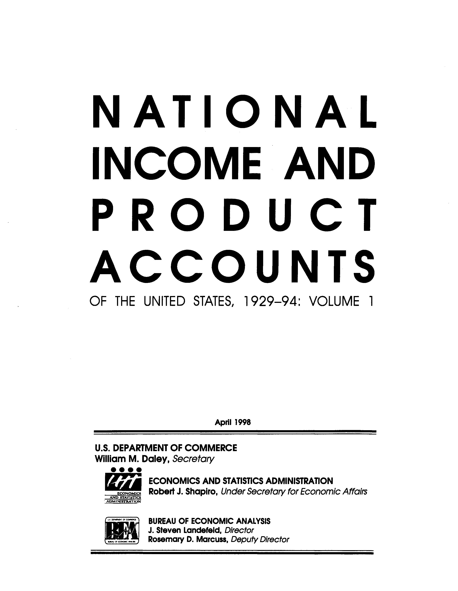
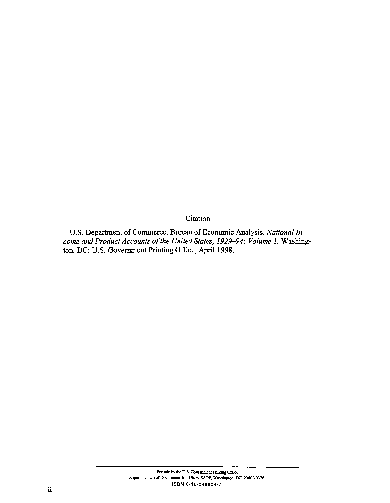
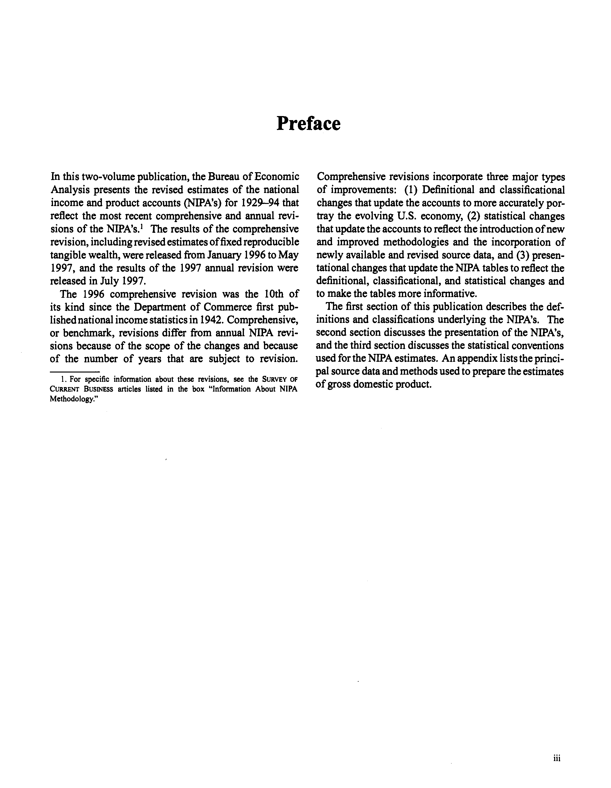
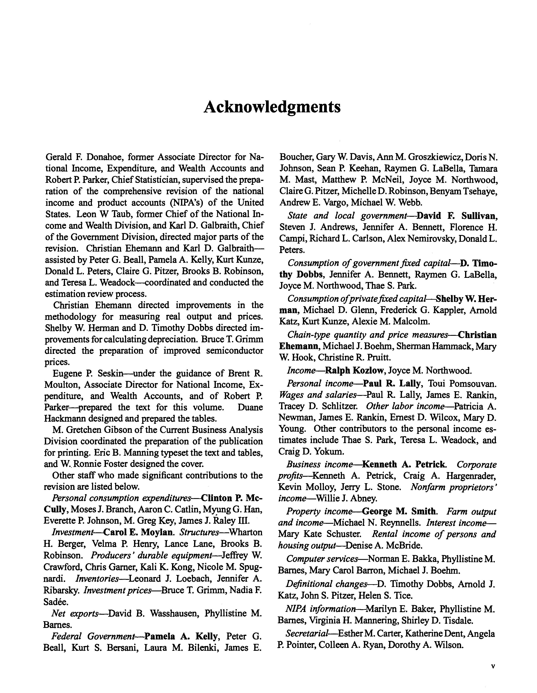
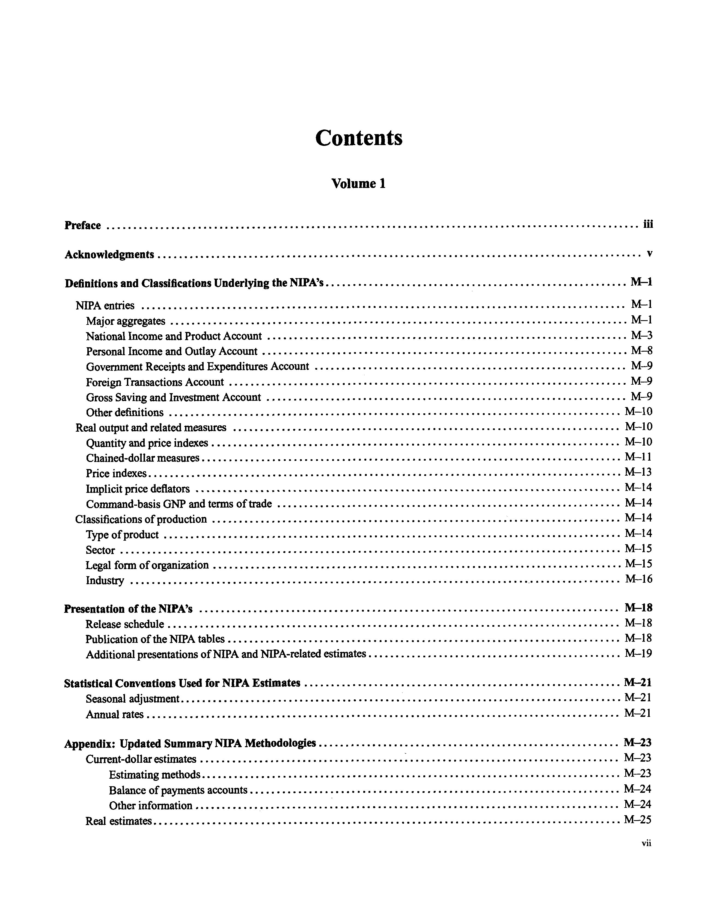

# [1998.04] Dept of Commerce - National Income and Product Accounts 1929-94 vol 1

*Processed on: 2025-09-27 03:14:25*

*Total pages: 5*

*Images extracted: 5*

*Tables extracted: 7*


## Processing Statistics

- **Pages processed:** 5

- **Images extracted:** 5

- **Tables extracted:** 7

- **Processing time:** 0.00 seconds

- **Peak memory usage:** 0.00 MB


## Page 1

N A T I O N A L 
INCOME AND 
P R O D U C T 
ACCOUNTS 
OF THE UNITED STATES, 1 9 2 9 - 9 4 : VOLUME 1 
April 1998 
U.S. DEPARTMENT OF COMMERCE 
William M. Daley, 
Secretary 
• • • • 
ECONOMICS AND STATISTICS ADMINISTRATION 
ECONOMICS Robert J. Shapiro, Under Secretary for Economic Affairs 
AND STATISTICS 
ADMINISTRATION 
BUREAU OF ECONOMIC ANALYSIS 
J. Steven Landefeld, Director 
Rosemary D. Marcuss, Deputy Director 
Digitized for FRASER 
http://fraser.stlouisfed.org/ 
Federal Reserve Bank of St. Louis


### Tables Detected

**Table 1 (pymupdf_text_analysis)**: 2 rows × 2 columns (confidence: 0.70)

*Data saved to: `page_001_table_01_pymupdf_text_analysis.csv`*

```

William M. Daley, | Secretary
ECONOMICS | Robert J. Shapiro, | Under Secretary for Economic Affairs

```

**Table 1 (pdfplumber_strategy_2)**: 31 rows × 6 columns (confidence: 0.48)

*Data saved to: `page_001_table_01_pdfplumber_strategy_2.csv`*


### Images



*Dimensions: 2560×3300 | Size: 68872 bytes | Color space: DeviceGray*


---


## Page 2

Citation 
U.S. Department of Commerce. Bureau of Economic Analysis. National In-
come and Product Accounts of the United States, 1929—94: Volume 1. Washing-
ton, DC: U.S. Government Printing Office, April 1998. 
For sale by the U.S. Government Printing Office 
Superintendent of Documents, Mail Stop: SSOP, Washington, DC 20402-9328 
ISBN 0 - 1 6 - 0 4 9 6 0 4 - 7 
Digitized for FRASER 
http://fraser.stlouisfed.org/ 
Federal Reserve Bank of St. Louis


### Tables Detected

**Table 1 (pdfplumber_strategy_2)**: 14 rows × 3 columns (confidence: 0.54)

*Data saved to: `page_002_table_01_pdfplumber_strategy_2.csv`*


### Images



*Dimensions: 2567×3305 | Size: 48754 bytes | Color space: DeviceGray*


---


## Page 3

Preface 
In this two-volume publication, the Bureau of Economic 
Analysis presents the revised estimates of the national 
income and product accounts (NIPA's) for 1929-94 that 
reflect the most recent comprehensive and annual revi-
sions of the NIPA's.1 The results of the comprehensive 
revision, including revised estimates of fixed reproducible 
tangible wealth, were released from January 1996 to May 
1997, and the results of the 1997 annual revision were 
released in July 1997. 
The 1996 comprehensive revision was the 10th of 
its kind since the Department of Commerce first pub-
lished national income statistics in 1942. Comprehensive, 
or benchmark, revisions differ from annual NIPA revi-
sions because of the scope of the changes and because 
of the number of years that are subject to revision. 
1. For specific information about these revisions, see the SURVEY OF 
CURRENT BUSINESS articles listed in the box "Information About NIPA 
Methodology." 
Comprehensive revisions incorporate three major types 
of improvements: (1) Definitional and classificational 
changes that update the accounts to more accurately por-
tray the evolving U.S. economy, (2) statistical changes 
that update the accounts to reflect the introduction of new 
and improved methodologies and the incorporation of 
newly available and revised source data, and (3) presen-
tational changes that update the NIPA tables to reflect the 
definitional, classificational, and statistical changes and 
to make the tables more informative. 
The first section of this publication describes the def-
initions and classifications underlying the NIPA's. The 
second section discusses the presentation of the NIPA's, 
and the third section discusses the statistical conventions 
used for the NIPA estimates. An appendix lists the princi-
pal source data and methods used to prepare the estimates 
of gross domestic product. 
Digitized for FRASER 
http://fraser.stlouisfed.org/ 
Federal Reserve Bank of St. Louis


### Tables Detected

**Table 1 (pdfplumber_strategy_2)**: 23 rows × 9 columns (confidence: 0.60)

*Data saved to: `page_003_table_01_pdfplumber_strategy_2.csv`*


### Images



*Dimensions: 2560×3300 | Size: 117238 bytes | Color space: DeviceGray*


---


## Page 4

Acknowledgments 
Gerald F. Donahoe, former Associate Director for Na-
tional Income, Expenditure, and Wealth Accounts and 
Robert P. Parker, Chief Statistician, supervised the prepa-
ration of the comprehensive revision of the national 
income and product accounts (NIPA's) of the United 
States. Leon W Taub, former Chief of the National In-
come and Wealth Division, and Karl D. Galbraith, Chief 
of the Government Division, directed major parts of the 
revision. Christian Ehemann and Karl D. Galbraith— 
assisted by Peter G. Beall, Pamela A. Kelly, Kurt Kunze, 
Donald L. Peters, Claire G. Pitzer, Brooks B. Robinson, 
and Teresa L. Weadock—coordinated and conducted the 
estimation review process. 
Christian Ehemann directed improvements in the 
methodology for measuring real output and prices. 
Shelby W. Herman and D. Timothy Dobbs directed im-
provements for calculating depreciation. Bruce T. Grimm 
directed the preparation of improved semiconductor 
prices. 
Eugene P. Seskin—under the guidance of Brent R. 
Moulton, Associate Director for National Income, Ex-
penditure, and Wealth Accounts, and of Robert P. 
Parker—prepared the text for this volume. 
Duane 
Hackmann designed and prepared the tables. 
M. Gretchen Gibson of the Current Business Analysis 
Division coordinated the preparation of the publication 
for printing. Eric B. Manning typeset the text and tables, 
and W. Ronnie Foster designed the cover. 
Other staff who made significant contributions to the 
revision are listed below. 
Personal consumption expenditures—Clinton P. Mc-
Cully, Moses J. Branch, Aaron C. Catlin, Myung G. Han, 
Everette P. Johnson, M. Greg Key, James J. Raley III. 
Investment—Carol E. Moylan. Structures—Wharton 
H. Berger, Velma P. Henry, Lance Lane, Brooks B. 
Robinson. Producers' durable equipment—Jeffrey W. 
Crawford, Chris Garner, Kali K. Kong, Nicole M. Spug-
nardi. 
Inventories—Leonard J. Loebach, Jennifer A. 
Ribarsky. Investment prices—Bruce T. Grimm, Nadia F. 
Sadee. 
Net exports—David B. Wasshausen, Phyllistine M. 
Barnes. 
Federal Government—Pamela A. Kelly, Peter G. 
Beall, Kurt S. Bersani, Laura M. Bilenki, James E. 
Boucher, Gary W. Davis, Ann M. Groszkiewicz, Doris N. 
Johnson, Sean P. Keehan, Raymen G. LaBella, Tamara 
M. Mast, Matthew P. McNeil, Joyce M. Northwood, 
Claire G. Pitzer, Michelle D. Robinson, Benyam Tsehaye, 
Andrew E. Vargo, Michael W. Webb. 
State and local government—David 
F. Sullivan, 
Steven J. Andrews, Jennifer A. Bennett, Florence H. 
Campi, Richard L. Carlson, Alex Nemirovsky, Donald L. 
Peters. 
Consumption of government fixed capital—D. Timo-
thy Dobbs, Jennifer A. Bennett, Raymen G. LaBella, 
Joyce M. Northwood, Thae S. Park. 
Consumption of privatefixed capital—Shelby W. Her-
man, Michael D. Glenn, Frederick G. Kappler, Arnold 
Katz, Kurt Kunze, Alexie M. Malcolm. 
Chain-type quantity and price measures—Christian 
Ehemann, Michael J. Boehm, Sherman Hanunack, Mary 
W. Hook, Christine R. Pruitt. 
Income—Ralph Kozlow, Joyce M. Northwood. 
Personal income—Paul R. Lally, Toui Pomsouvan. 
Wages and salaries—Paul R. Lally, James E. Rankin, 
Tracey D. Schlitzer. Other labor income—Patricia A. 
Newman, James E. Rankin, Ernest D. Wilcox, Mary D. 
Young. Other contributors to the personal income es-
timates include Thae S. Park, Teresa L. Weadock, and 
Craig D. Yokum. 
Business income—Kenneth A. Petrick. 
Corporate 
profits—Kenneth A. Petrick, Craig A. Hargenrader, 
Kevin Molloy, Jerry L. Stone. Nonfarm proprietors' 
income—Willie J. Abney. 
Property income—George M. Smith. Farm output 
and income—Michael N. Reynnells. Interest income— 
Mary Kate Schuster. 
Rental income of persons and 
housing output—Denise A. McBride. 
Computer services—Norman E. Bakka, Phyllistine M. 
Barnes, Mary Carol Barron, Michael J. Boehm. 
Definitional changes—D. Timothy Dobbs, Arnold J. 
Katz, John S. Pitzer, Helen S. Tice. 
NIPA information—Marilyn E. Baker, Phyllistine M. 
Barnes, Virginia H. Mannering, Shirley D. Tisdale. 
Secretarial—Esther M. Carter, Katherine Dent, Angela 
P. Pointer, Colleen A. Ryan, Dorothy A. Wilson. 
Digitized for FRASER 
http://fraser.stlouisfed.org/ 
Federal Reserve Bank of St. Louis


### Tables Detected

**Table 1 (pymupdf_text_analysis)**: 15 rows × 4 columns (confidence: 0.70)

*Data saved to: `page_004_table_01_pymupdf_text_analysis.csv`*

**Table 1 (pdfplumber_strategy_2)**: 63 rows × 7 columns (confidence: 0.57)

*Data saved to: `page_004_table_01_pdfplumber_strategy_2.csv`*


### Images



*Dimensions: 2560×3300 | Size: 243081 bytes | Color space: DeviceGray*


---


## Page 5

Contents 
Volume 1 
Preface 
iii 
Acknowledgments 
v 
Definitions and Classifications Underlying the NIPA's 
M-l 
NIPA entries 
M-l 
Major aggregates 
M-l 
National Income and Product Account 
M-3 
Personal Income and Outlay Account 
M-8 
Government Receipts and Expenditures Account 
M-9 
Foreign Transactions Account 
M-9 
Gross Saving and Investment Account 
M-9 
Other definitions 
M-10 
Real output and related measures 
M-10 
Quantity and price indexes 
M-10 
Chained-dollar measures 
M-l 1 
Price indexes 
M-l 3 
Implicit price deflators 
M-l 4 
Command-basis GNP and terms of trade 
M-l 4 
Classifications of production 
M-l 4 
Type of product 
M-14 
Sector 
M-l 5 
Legal form of organization 
M-l 5 
Industry 
M-l 6 
Presentation of the NIPA's 
M-18 
Release schedule 
M-18 
Publication of the NIPA tables 
M-18 
Additional presentations of NIPA and NIPA-related estimates 
M-19 
Statistical Conventions Used for NIPA Estimates 
M-21 
Seasonal adjustment 
M-21 
Annual rates 
M-21 
Appendix: Updated Summary NIPA Methodologies 
M-23 
Current-dollar estimates 
M-23 
Estimating methods 
M-23 
Balance of payments accounts 
M-24 
Other information 
M-24 
Real estimates 
M-25 
Digitized for FRASER 
http://fraser.stlouisfed.org/ 
Federal Reserve Bank of St. Louis


### Tables Detected

**Table 1 (pdfplumber_strategy_2)**: 51 rows × 4 columns (confidence: 0.56)

*Data saved to: `page_005_table_01_pdfplumber_strategy_2.csv`*


### Images



*Dimensions: 2572×3309 | Size: 116173 bytes | Color space: DeviceGray*


---

